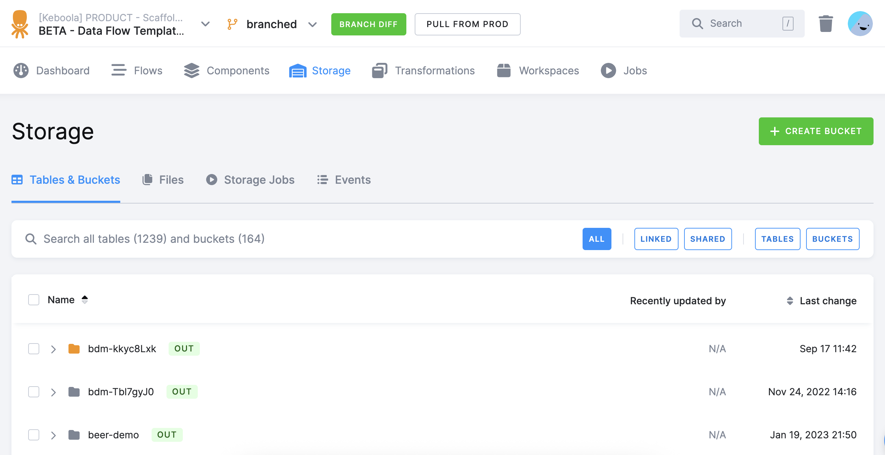

* TOC
{:toc}

*If you already know how development branches work in general and want to create and start using your first branch, 
go to our [Getting Started tutorial](/tutorial/branches/).*

Development Branches allow you to modify [component configurations](/components/) without interfering with running 
configurations or entire [orchestrated pipelines](/orchestrator/). They are ideal to use when making bigger changes 
to a project or when you need to be extra careful about performing your changes safely. 

To give an example, let's say that you have an ordinary orchestration that extracts, transforms and writes data 
to a target system, and you need to remove a column from the source. To do that, you must modify several configurations, 
and ideally, also perform a dry run to check that the data in the target system is correct. However, modifying a pipeline 
that runs, e.g., every ten minutes, is difficult without an outage of the pipeline. Development Branches are designed 
to help in such situations.



## How Branches Work
When you create a development branch in your project, you obtain an exact copy of the project and all its current 
configurations. You can then modify these configurations without ever touching the original ones in production, 
and these will keep running in orchestrations. 

When you run a configuration in a branch, it is able to **read** the [tables](/storage/tables/) and [files](/storage/files/) 
from the Storage as if it were a normal configuration. However, when your branch configuration attempts to **write** data
(tables or files) to Storage, it is stored separately and does not overwrite the original production data and interfere
with the running configurations. There is no need to duplicate your project's data when creating a new branch. 

### Branched Storage Architecture

Under the hood, development branches now use a *branched storage architecture*.  
This architecture creates a complete clone of the production Storage database, with a unique **branch-specific prefix** applied to all stored objects.  

This means that:
- Each branch operates on an isolated snapshot of the production dataset.
- Reads fall back to production data when a branch-specific version is not available.
- Writes always target the branch-prefixed buckets and files, ensuring that production data remains untouched.

This design improves isolation, reliability, and performance when working in branches — especially for large-scale projects where multiple users or automated processes work in parallel.

{: .image-popup}

---

### Data Pipelines

When you create a data source connector and then transform the data it produces using transformation it behaves the following way in branches: 

In production, you created a data source connector that extracts your website requests data to a bucket called `in.c-requests`. Then you create a transformation that takes the data from `in.c-requests` and transforms it into aggregated visits to a bucket named `out.c-visits`. You've already executed the pipeline multiple times, so both buckets have production data in them.

Now when you switch to a new branch, and run the transformation. It will load the input data from `in.c-requests` and transform it. When it's about to write it back to storage, it will automatically prefix the output bucket with an ID of the branch - `out.c-1234-visits`. Your production data is left intact in `out.c-visits`.

Bucket name is automatically prefixed with branch numeric ID when a job writes to storage in development branch.

Now you run the data source connector in the branch. It stores the data in a bucket prefixed with branch ID - `in.c-1234-requests`. You production data is again left intact in `in.c-requests`.
But when you now run the transformation, it will automatically check if you have branch version of the source bucket `in.c-requests`. Because you do have `in.c-1234-requests`, it will load the data from there.

When a job reads from storage in development branch it checks if there is a branch version of the bucket and uses it. If there is none, it will fallback to reading from production bucket instead.

This allows you to test the whole pipeline from start to finish with actual data in a complete isolation from your production data. Also, you don't need to re-run all you production jobs to get the data to the branch.

## Creating a Branch
If you have your configurations ready in production and want to create a branch to test some changes, click on your project’s name 
at the top of the screen. Then click on the green icon **New** displayed next to your project’s name.

{: .image-popup}

Name your new branch and click **Create Development Branch** to open it.

{: .image-popup}

The branch will appear right below the name of your production project.

{: .image-popup}
.

Now you can start modifying your configurations, run them, and analyze the results. 

If you want to learn more about working in a branch, follow our [tutorial](/tutorial/branches/).

## Closing a Branch
Before you merge your development branch back to production, check a detailed [diff of the configuration changes](/tutorial/branches/project-diff/). 

You can end your branch's lifecycle in two ways:

- **Deleting** -- if you do not wish to use the changes you've made and want to simply discard them. The data associated with the branch is discarded when the branch is deleted.
- [**Merging into production**](/tutorial/branches/merge-to-production/) -- all changes in the configurations are brought back to the respective production configurations. All the changes are applied at once (after you approve them) and produce new [versions](/components/#configuration-versions) of the respective configurations. The branch can be either deleted or kept for further reference after merging. 

***Important:** All of this happens within the same project, enabling collaboration with other project members on the modifications.*

## Component Considerations

Certain components are not allowed to run in development branches. There are following special cases where components' functionality is limited in the development branches.

### Working with External Resources

Some components, like writers, can write to a destination that is external to Keboola. Those components'
configs are first marked as *unsafe* in development branch.

You will not be able to run an unsafe config. You need to first observe the config and verify that it's either OK to
write to the destination, or change the destination accordingly.

### OAuth Authorized Components

Components using OAuth does not allow authorizing nor changing the OAuth in development branch. The OAuth authorization tokens are shared with production so changing them might break the production pipeline.

*****

***Important:** Development branches are for development and testing only, so setting up status notifications on Flows is not supported.*

