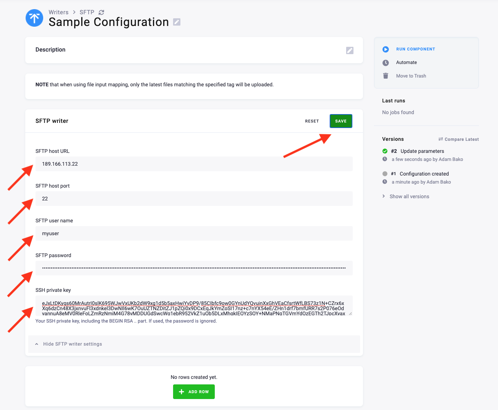
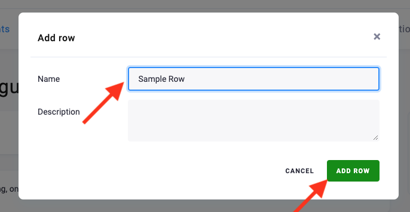
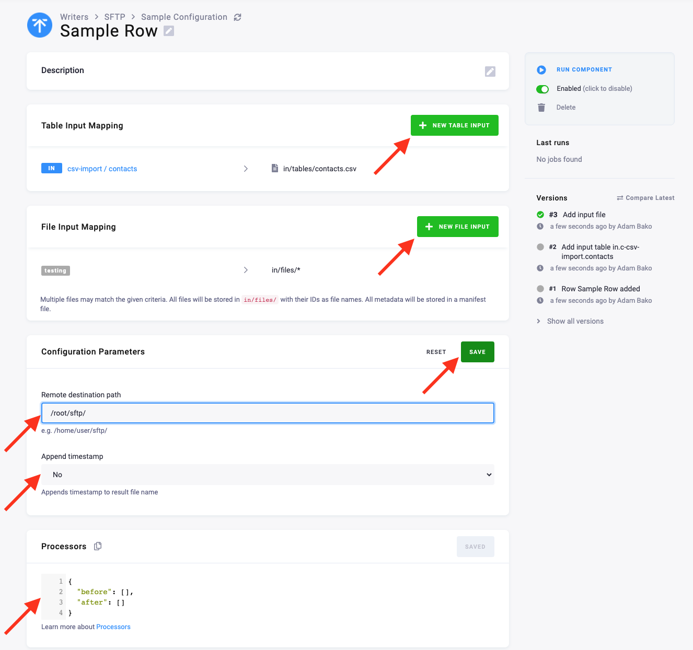

* TOC
{:toc}
  

This data destination connector allows you to write tables and files to a remote SFTP server.

## Configuration

[Create a new configuration](https://help.keboola.com/components/#creating-component-configuration) 
of the SFTP data destination connector. 
Then provide the target SFTP server URL, port (default is 22), and authentication, either via 
a username and a password, or with a private key.

{: .image-popup}
 

__Save__ the SFTP parameters and continue to the 
[configuration rows](https://help.keboola.com/components/#configuration-rows) by clicking the 
**Add Row** button, which will prompt you to create a new row configuration.

{: .image-popup}
 

__Add__ the new row and fill in the [tables](https://help.keboola.com/transformations/mappings/#table-input-mapping) 
and [files](https://help.keboola.com/transformations/mappings/#file-input-mapping) you want to write to the SFTP server.
Add new tables with the **New Table Input** button. Once added, the tables will show up in the Table Input Mapping.
Add new files with the **New File Input** button. You can add files using 
[file tags](https://help.keboola.com/transformations/mappings/#file-input-mapping).

Next, configure the parameters by adding the remote destination path in the SFTP server. 
Make sure the remote destination path exists on the server.

Then configure the append timestamp parameter. This will append the current timestamp to the filename. 
If you are uploading the same tables and want to have historical records, this would be your solution.

When these parameters are set, **save** the configuration.

If you want to add [processors](https://developers.keboola.com/extend/component/processors/) 
to the files or tables before the input, you can specify these in the processor configuration window.

{: .image-popup}
 

