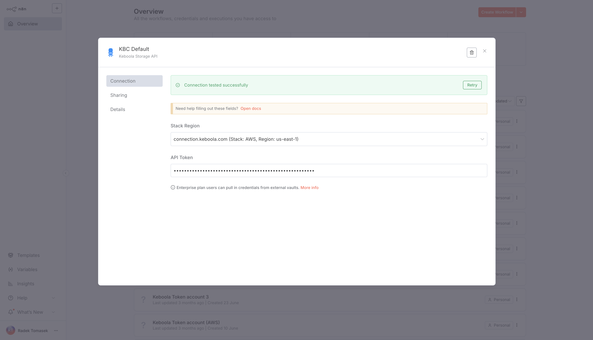
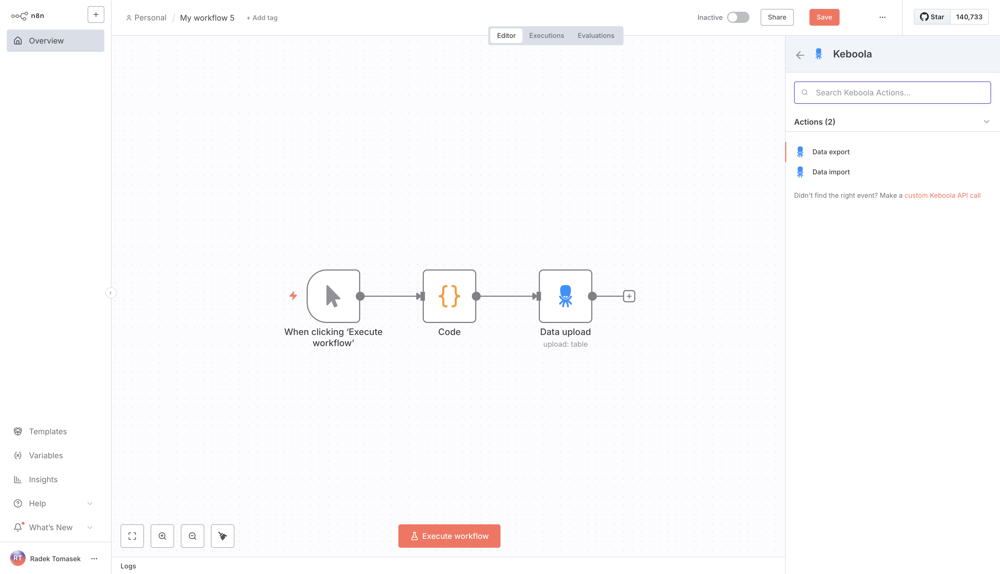

* TOC
{:toc}

Connect Keboola with n8n to automate workflows, trigger data pipelines, and integrate Keboola's data platform with hundreds of other services.

[n8n](https://n8n.io) is an open-source workflow automation tool. With the Keboola integration for n8n, you can orchestrate data pipelines, move data between systems, and embed Keboola into your broader automation ecosystem.

In this guide, you'll learn how to set up the Keboola node in n8n, connect it to your project, and start building workflows.

## Prerequisites

Before you begin, make sure you have:
- A Keboola project (You can create one for [free](https://connection.us-east4.gcp.keboola.com/wizard)).
- A [Keboola Storage API Token](/management/project/tokens) (with the necessary permissions).
- An [n8n instance](https://docs.n8n.io/learning-path) (currently, just the self-hosted variant is supported).

## Install the Keboola Node (Self-hosted)

If you’re running a self-hosted n8n instance, you can install the Keboola node via the Community Nodes feature.

1. Open your n8n instance.
2. Go to **Settings → Community Nodes**.
3. Select **Install a community node**.
4. Enter the npm package name: `@keboola/n8n-nodes-keboola`.
5. Accept the community node disclaimer and confirm installation.

You can now use the Keboola node in your workflows.

## Authentication

The Keboola node uses **API Key authentication**.

1. In the n8n Editor UI, click the **Add** button (+) in the sidebar and select **Create Credential**.
2. Search for **Keboola Token API** and click **Continue**.
3. Select your stack region from the dropdown:
   - [https://connection.keboola.com](https://connection.keboola.com) (Stack: AWS, Region: us-east-1)
   - [https://connection.eu-central-1.keboola.com](https://connection.eu-central-1.keboola.com) (Stack: AWS, Region: eu-central-1)
   - [https://connection.north-europe.azure.keboola.com](https://connection.north-europe.azure.keboola.com) (Stack: Azure, Region: north-europe)
   - [https://connection.us-east4.gcp.keboola.com](https://connection.us-east4.gcp.keboola.com) (Stack: US East, Region: us-east4)
4. Enter your **Keboola Storage API Token** associated with the selected region.
   - You can find or create tokens in Keboola under **Project Settings → API Tokens**.
5. Click **Save**. You should see a confirmation message once the connection is established.

Once configured, the credential can be reused across all Keboola nodes in your workflows.

## Create a Workflow with the Keboola Node

Once your credential is configured, you can start building workflows with the Keboola node.

1. In n8n, create a new workflow.
2. In the Editor UI, click the **Open nodes panel** button (+) on the canvas.
3. Search for a **Keboola node**.
4. Select the **Action** you want to perform:
   - **Data Export** – extract data from a Keboola table.
   - **Data Import** – write data from your workflow into a Keboola table.
5. Configure the node parameters (e.g., table ID for download, bucket and table details for upload).
6. Connect the Keboola node with other n8n nodes (e.g., Google Sheets, MCP, Slack, HTTP Request) to design your automation.
7. Execute the workflow to test and validate your integration.

## Available Operations

The Keboola node currently supports two main operations:

### **Data Export**

Extracts data from a Keboola table.
- **Parameters:**
  - Credential (select your Keboola connection)
  - Resource (Table)
  - Operation (Extract)
  - Table ID

This lets you pull data from a specific table and pass it to downstream nodes in your workflow.

### **Data Import**

Uploads data from your workflow into Keboola.
- **Parameters:**
  - Credential (select your Keboola connection)
  - Resource (Table)
  - Operation (Upload)
  - Bucket Stage (Input/Output)
  - Bucket Name
  - Table Name
  - Primary Key(s)
  - Import Mode (Full Load or Incremental)

This allows you to insert or update tables inside Keboola directly from your n8n workflows.

### **Custom API Call**

If you need functionality that isn’t covered by the node’s built-in actions, you can use the **Custom Keboola API Call** option to send requests directly to the Storage API. This gives you full flexibility until additional actions are added to the node.

## Resources

- [Keboola API Documentation](https://developers.keboola.com/overview/api)
- [n8n Documentation](https://docs.n8n.io)
- [n8n Community Nodes Guide](https://docs.n8n.io/integrations/#community-nodes)
- [NPM Package](https://www.npmjs.com/package/@keboola/n8n-nodes-keboola)
- [GitHub Repository](https://github.com/keboola/n8n-nodes-keboola)

## Troubleshooting

- **Authentication errors**: Verify that your API Token has sufficient permissions for the chosen operation.
- **Operation errors**: Double-check input parameters such as bucket names, table IDs, or job IDs.
- **Node not available**: Confirm the Keboola node is installed from the Community Nodes registry. There is currently support for self-hosted n8n instances only. We are working on adding support for n8n Cloud too (stay tuned).

For further help, reach out via [Keboola Support](https://help.keboola.com).
