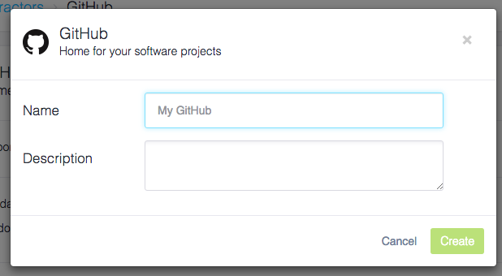
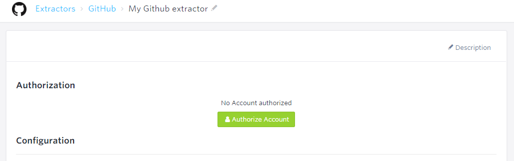
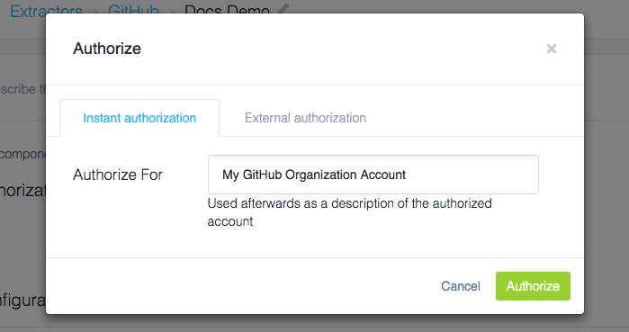

* TOC
{:toc}

The GitHub extractor uses the [GitHub API](https://developer.github.com/v3/) to import data from [GitHub](https://github.com/)
to Keboola Connection (KBC).

## Create New Configuration
Find GitHub in the list of extractors and create a new configuration. Name it (you can change the name any time).

{: .image-popup}

## Authorize GitHub Account
Click **Authorize Account** to be redirected to GitHub, and authorize the extractor to access a GitHub account.

{: .image-popup}

Select one of the two authorization methods:

 - **Instant** -- Use this if you have access to a GitHub account; the authorization will be done immediately.
 - **External** -- If you need to authorize access to the service from someone who does not have an account in KBC,
 you can generate an external link, which will guide them through this process.

{: .image-popup}

Then log in to your GitHub profile:

{: .image-popup}

## Configuration Templates
Select the template you wish to use. There are two configuration templates available:

- `Smart Mode` -- always gets missing data only
- `Full Mode` -- always gets everything

You can download:

- Your Organizations
- Organization Members
- Organization Teams
- Organization Repositories
- Repository Issues
- Repository Commits

After you select the template, remember to save the configuration.

## Advanced Mode
For more features, switch the configuration of each table to the Power User Mode by clicking the Open JSON editor link.
JSON configuration uses the [Generic extractor](https://developers.keboola.com/extend/generic-extractor/) format.
