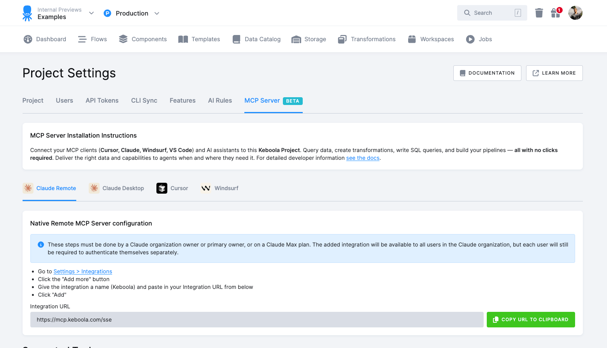

* TOC
{:toc}

The **Keboola MCP Server** allows you to connect your MCP clients (**Cursor**, **Claude**, **Windsurf**, **VS Code**) and AI assistants to your **Keboola Project** and give them the powers of a Keboola Expert user. 

Query data, create transformations, write SQL queries, and build your pipelines — **all with no clicks required.**

This section provides information on how to connect external AI tools and developer environments—such as **Cursor**, **Claude**, **Windsurf**, and **VS Code**—to this **Keboola Project**. 
This page provides everything needed to set up and manage those integrations, including installation instructions, tool-specific configuration steps, and integration URLs.

For more information refer to the [MCP Server documentation section](/ai/mcp-server/).

{: .image-popup}

