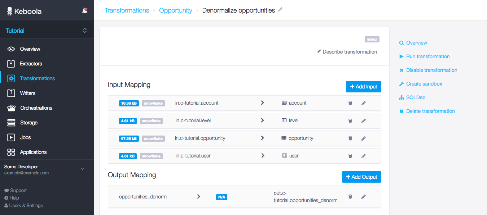
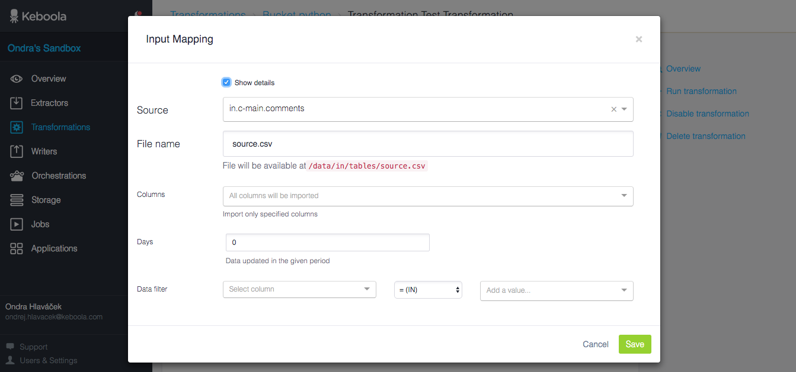
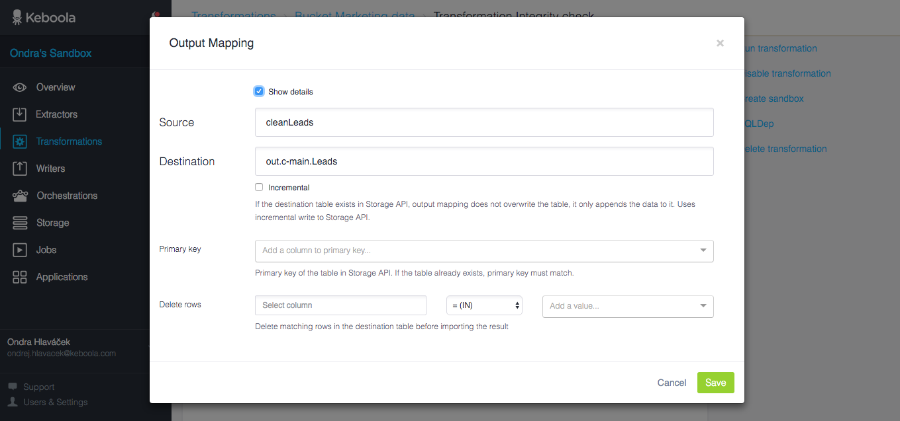

* TOC
{:toc}

*See how transformations are an integral part of the workflow in our [Getting Started tutorial](/overview/tutorial/manipulate/).*

**Transformation** allows you to manipulate data in your project. Transformation is a task you want to achieve - eg. *Marketing data preaggregation*, *Tableau denormalizer*, *Integrity checker* or *Join marketing channels and sales*.
Transformations are grouped into folders called **Transformation buckets** and each transformation within a bucket can use a different backend to perform the task with the most suitable tool or language. Some tasks are difficult to solve in SQL, so don't be afraid to step in with Python and finish the work with SQL again. Currently available backends are:

 - SQL
   - [MySQL](./mysql/)
   - [Redshift](./redshift/)
   - [Snowflake](./snowflake/)
 - Script
   - [R](./r/)
   - [Python](./python/)

## Backends

How to decide which backend is appropriate for each task? A rule of thumb is that SQL performs better for joining tables, filtering data, grouping and simple aggregations. Script languages are more suitable for processing one line at a time, raw data processing or custom analytical tasks. 

### SQL

Choosing between [MySQL](./mysql/), [Redshift](./redshiftú) and [Snowflake](./snowflake/) can be a matter of your preference or the overall performance. Many projects start with MySQL and as their projects grow, they switch to Redshift on their own dedicated cluster. That unfortunately requires rewriting the SQL code.
  
### Script

[Python](./python/) or [R](./r/)? Choose according to your taste and available libraries.

## Mappings

Input and output mapping is used to separate the source data from your transformation, so you can be sure, that you SQL code or script won't harm the source tables. Each transformation has a secure workspace with copied data from the tables specified in the input mappings and after the transformation has executed successfully, only tables/files that are defined in the output mappings are brought back to Storage. Any other artifacts (temporary tables/files) are deleted permanently from the transformation workspace when the execution finishes.   

{: .image-popup}

### Input mapping 

Input mapping defines data, that you have in the Storage and want to use in a transformation. This data will be made available as a table (for SQL) or a CSV file (for R and Python).

{: .image-popup}

Any input mapping has the following options

 - **Source** - Table identifier in Storage
 - **File name**/**Destination** - Destination file name for your script or table name for your SQL; file names should end with `.csv`
 - **Columns** - Select columns, if you don't want to import all columns. Saves processing time for larger tables
 - **Days** - If you're into incremental processing, this comes in handy; imports only rows changed during given number of days (`0` downloads all)
 - **Data filter** - Download only rows, that will match this single column multiple values filter
 
 You can combine these options freely. Input mappings for Snowflake, MySQL and Redshift have input mappings specific to the backends and include more options
  
  - **Data types** (MySQL, Redshift, Snowflake) - Data type for each column (Redshift allows to set [column compression type](http://docs.aws.amazon.com/redshift/latest/dg/t_Compressing_data_on_disk.html) as well)
  - **Indexes** (MySQL) - Create indexes on the destination table
  - **Sort key** (Redshift) - Table [sort key](http://docs.aws.amazon.com/redshift/latest/dg/t_Sorting_data.html)
  - **Dist key** (Redshift) - Table [distribution key](http://docs.aws.amazon.com/redshift/latest/dg/t_Distributing_data.html) and  [distribution style](http://docs.aws.amazon.com/redshift/latest/dg/c_choosing_dist_sort.html)
  - **COPY options** (Redshift) - Specifies options for the Redshift [COPY command](http://docs.aws.amazon.com/redshift/latest/dg/r_COPY.html)
  - **Table type** (Redshift) - The table can be either completely transferred (using `CREATE TABLE`) or just created as a `CREATE VIEW` from the source table on the same Redshift cluster 

### Output mapping

Output mapping takes the results (tables or files) from you transformation and stores it back in Storage. It can create/overwrite/append any table. These tables are typically derived from the tables/files in Input mapping. In SQL transformations you can use any `CREATE TABLE`, `CREATE VIEW`, `INSERT`, `UPDATE` or `DELETE` queries to create the desired result.
 

 
Any output mapping has the following options
 
  - **Source** - Either a table name in the transformation database or a file name (including `.csv`)
  - **Destination** - Table identifier in Storage
  - **Incremental** - Use incremental upload to Storage
  - **Primary key** - Primary key of the destination table, if the table already exists, the primary key must match; feel free to use multi-column primary key
  - **Delete rows** - Delete rows matching the criteria from the destination table before importing the data

## Versions

Each change in the transformation configuration creates a new version of the whole bucket configuration. You can easily access previous versions of all transformations in a bucket and see what's changed.

## Developing transformations

You can easily develop MySQL and Redshift transformations using [Sandbox](/manipulation/transformations/sandbox). We provide you with a safe workspace with required data, where you can play with your SQL code.

## Advanced features

### Phases

Phases allow you to run multiple transformation steps within a single workspace (eg. single MySQL database). It might save a bit of processing time if multiple steps use the same input mapping (they share data), but ultimately makes everything less clear and isolated. To save time you can run multiple orchestration tasks in parallel.

### Dependencies

Dependencies allow you to chain transformation steps. The given transformation is executed after all required steps have been executed. Originally we thought this was a cool idea and it allowed everyone to build a network of interdependent and reusable blocks of SQL code.

