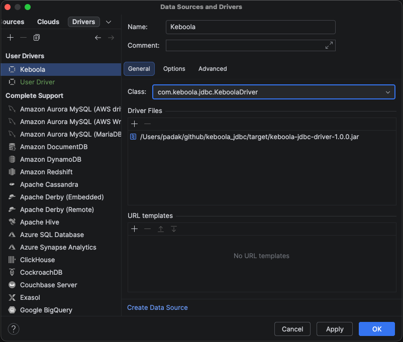
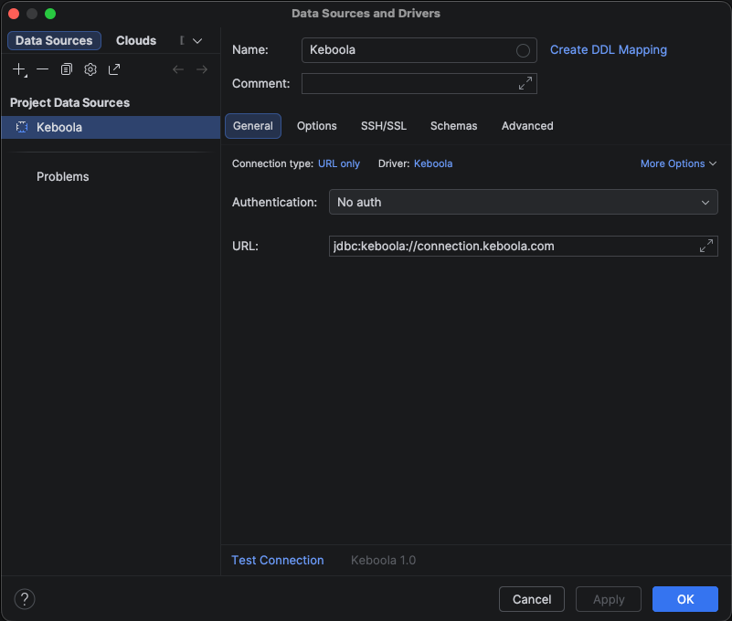

This guide walks you through installing the Keboola JDBC driver in [DataGrip](https://www.jetbrains.com/datagrip/) and connecting to a Keboola project. The same flow works for any JetBrains IDE with the **Database Tools and SQL** plugin (IntelliJ Ultimate, PyCharm Professional, etc.).

## Prerequisites

- DataGrip 2023.1 or newer
- A Keboola Storage API token with workspace access — see [Storage API token](/workspace/jdbc-driver/#prerequisites-storage-api-token) for how to create one

## 1. Download the driver

Download the latest `keboola-jdbc-driver-X.Y.Z.jar` from the [GitHub Releases page](https://github.com/keboola/jdbc-driver/releases/latest).

Save it somewhere stable on your machine — e.g. `~/keboola/keboola-jdbc-driver.jar`.

## 2. Register the driver in DataGrip

1. Open the **Database** tool window (View → Tool Windows → Database).
2. Click the **+** icon → **Driver**.

   

3. Fill in the driver details:
   - **Name:** `Keboola`
   - **Driver Files:** click **+** → **Custom JARs…** and pick the downloaded jar.
   - **Class:** select `com.keboola.jdbc.KeboolaDriver` from the dropdown (DataGrip scans the jar automatically).
   - **URL templates:** add `jdbc:keboola://{host}`
   - **Dialect:** `Generic SQL` (or `Snowflake` if you prefer that completion grammar — the driver targets Snowflake under the hood).

4. **Apply** and **OK**.

## 3. Create a connection

1. In the Database tool window, click **+** → **Data Source → Keboola**.

   

2. Fill in the connection form:
   - **URL:** `jdbc:keboola://connection.keboola.com` (replace the host with your Keboola stack, e.g. `connection.eu-central-1.keboola.com`)
   - **User / Password:** leave empty.

3. Open the **Advanced** tab and add these properties:

   | Property | Required | Description |
   |---|---|---|
   | `token` | yes | Your Keboola Storage API token |
   | `branch` | no | Specific branch ID. Auto-detected (default branch) if omitted |
   | `workspace` | no | Specific workspace ID. Newest workspace is auto-selected if omitted |

4. Click **Test Connection**. On success, **OK**.

## 4. First query

Open a query console against the new data source and run:

```sql
KEBOOLA HELP;

SELECT * FROM _keboola.buckets LIMIT 10;
```

`KEBOOLA HELP` lists every Keboola-specific command. `_keboola.buckets` is one of five virtual tables exposing platform metadata (`components`, `events`, `jobs`, `tables`, `buckets`).

## Troubleshooting

- **"Property 'token' is required"** — the token wasn't added under the **Advanced** tab. Re-open the data source and add it.
- **Authentication or 403 errors** — your token is likely bucket-scoped. Verify by hitting `https://connection.keboola.com/v2/storage/tokens/verify` with header `X-StorageApi-Token: <your-token>`; a bucket-scoped token will not see workspaces. Create a non-scoped token per the [Storage API token](/workspace/jdbc-driver/#prerequisites-storage-api-token) section.
- **"No workspaces found"** — the project has no workspace yet. Open the project in Keboola UI and create a workspace (Transformations → Workspaces).
- **Custom stack** — replace the host in the JDBC URL with your stack hostname (e.g. `jdbc:keboola://connection.north-europe.azure.keboola.com`).

## Need Help?

For further help, reach out via [Keboola Support](/management/support/).
