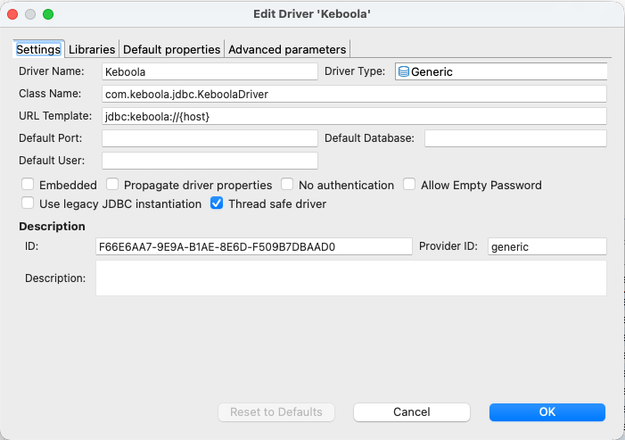
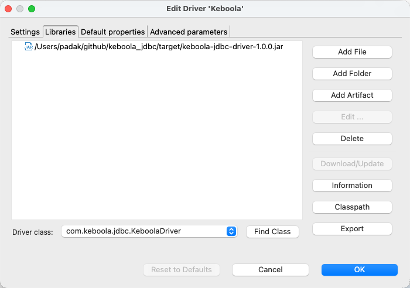
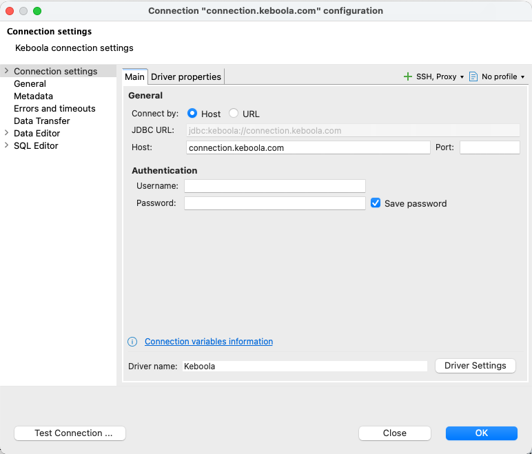
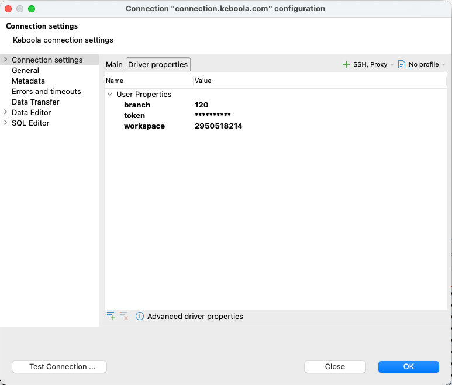

This guide walks you through installing the Keboola JDBC driver in [DBeaver](https://dbeaver.io/) and connecting to a Keboola project.

## Prerequisites

- DBeaver Community or PRO (any recent version with JDBC driver support)
- Java 11 or newer available to DBeaver (DBeaver ships its own JRE on most platforms)
- A Keboola Storage API token with workspace access — see [Storage API token](/workspace/jdbc-driver/#prerequisites-storage-api-token) for how to create one

## 1. Download the driver

Download the latest `keboola-jdbc-driver-X.Y.Z.jar` from the [GitHub Releases page](https://github.com/keboola/jdbc-driver/releases/latest).

Save the jar somewhere stable on your machine — e.g. `~/keboola/keboola-jdbc-driver.jar`.

## 2. Register the driver in DBeaver

1. Open **Database → Driver Manager**.
2. Click **New**.

   

3. Fill in the driver details:
   - **Driver Name:** `Keboola`
   - **Class Name:** `com.keboola.jdbc.KeboolaDriver`
   - **URL Template:** `jdbc:keboola://{host}`
   - **Default Port:** *(leave empty)*
4. On the **Libraries** tab, click **Add File** and select the jar you downloaded.

   

5. Click **Find Class** to confirm DBeaver detects `com.keboola.jdbc.KeboolaDriver`, then **OK**.

## 3. Create a connection

1. **Database → New Database Connection**, then select **Keboola** from the driver list.

   

2. Fill in the connection form:
   - **JDBC URL:** `jdbc:keboola://connection.keboola.com` (replace the host with your Keboola stack, e.g. `connection.eu-central-1.keboola.com`)
   - **User name:** *(leave empty)*
   - **Password:** *(leave empty)*

3. Open **Driver properties** and add the token plus any optional overrides:

   | Property | Required | Description |
   |---|---|---|
   | `token` | yes | Your Keboola Storage API token |
   | `branch` | no | Specific branch ID. Auto-detected (default branch) if omitted |
   | `workspace` | no | Specific workspace ID. Newest workspace is auto-selected if omitted |

   

4. Click **Test Connection**. On success, **Finish**.

## 4. First query

Open a SQL editor against the new connection and run:

```sql
KEBOOLA HELP;

SELECT * FROM _keboola.buckets LIMIT 10;
```

`KEBOOLA HELP` lists every Keboola-specific command. `_keboola.buckets` is one of five virtual tables exposing platform metadata (`components`, `events`, `jobs`, `tables`, `buckets`).

## Troubleshooting

- **"Property 'token' is required"** — the token wasn't added under Driver properties. Re-open the connection settings and add it.
- **Authentication or 403 errors** — your token is likely bucket-scoped. Verify by hitting `https://connection.keboola.com/v2/storage/tokens/verify` with header `X-StorageApi-Token: <your-token>`; a bucket-scoped token will not see workspaces. Create a non-scoped token per the [Storage API token](/workspace/jdbc-driver/#prerequisites-storage-api-token) section.
- **"No workspaces found"** — the project has no workspace yet. Open the project in Keboola UI and create a workspace (Transformations → Workspaces).
- **Custom stack** — replace the host in the JDBC URL with your stack hostname (e.g. `jdbc:keboola://connection.north-europe.azure.keboola.com`).

## Need Help?

For further help, reach out via [Keboola Support](/management/support/).
