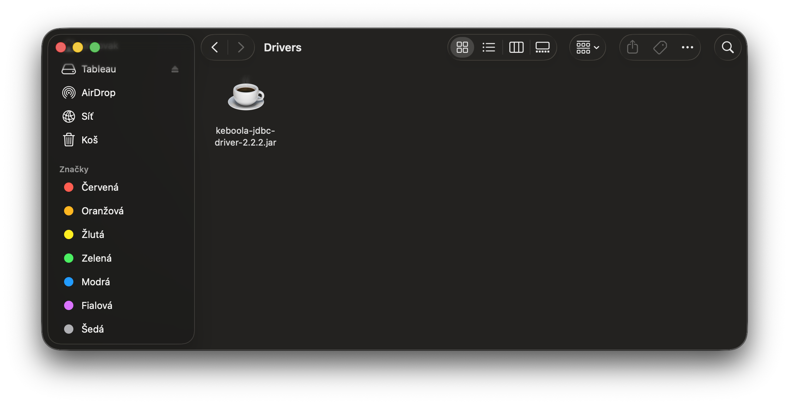
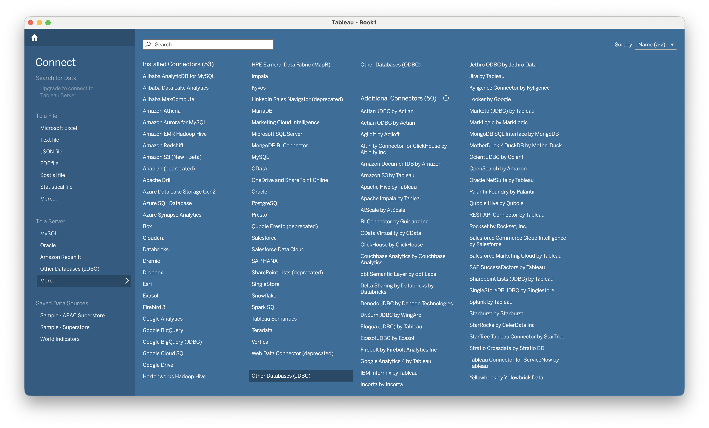
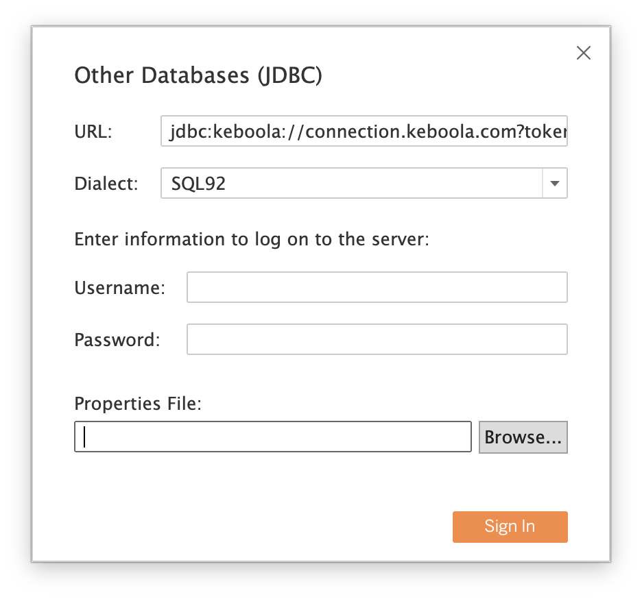

This guide walks you through installing the Keboola JDBC driver in [Tableau Desktop](https://www.tableau.com/products/desktop) using the generic **Other Databases (JDBC)** connector.

:::note
Tableau's JDBC connector has no UI for custom driver properties. Supply the Storage API token in the **Password** field — the driver accepts it there so the token stays out of the JDBC URL. (Tableau stores the URL as plaintext in saved/published data sources, but treats the password as a credential.)
:::

## Prerequisites

- Tableau Desktop 2021.1 or newer (older versions have an unreliable JDBC connector)
- A Keboola Storage API token with workspace access — see [Storage API token](/workspace/jdbc-driver/#prerequisites-storage-api-token) for how to create one

## 1. Download the driver

Download the latest `keboola-jdbc-driver-X.Y.Z.jar` from the [GitHub Releases page](https://github.com/keboola/jdbc-driver/releases/latest).

## 2. Install the driver

Place the jar in Tableau's drivers directory:

| OS | Path |
|---|---|
| macOS | `~/Library/Tableau/Drivers/` |
| Windows | `C:\Program Files\Tableau\Drivers\` |
| Linux | `/opt/tableau/tableau_driver/jdbc/` |

Create the directory if it doesn't exist. **Restart Tableau Desktop** after dropping the jar — Tableau only scans the drivers folder at startup.



## 3. Create a connection

1. In Tableau, choose **Connect → To a Server → More… → Other Databases (JDBC)**.

   

2. Fill in the connection form:
   - **URL:**
     ```
     jdbc:keboola://connection.keboola.com
     ```
     Replace the host with your Keboola stack (e.g. `connection.eu-central-1.keboola.com`). Optional: append `?branch=<id>&workspace=<id>` to pin a specific branch or workspace; both are auto-detected if omitted.
   - **Dialect:** `SQL92`
   - **Username:** leave empty.
   - **Password:** your **Storage API token**. The driver reads the token from the password field, keeping it out of the (plaintext) URL.

   

3. Click **Sign In**.

## 4. First query

In the data source pane, switch to **New Custom SQL** and run:

```sql
SELECT * FROM _keboola.buckets LIMIT 10
```

This returns one row per bucket in your project and confirms the driver is wired up. `_keboola.buckets` is one of five virtual tables exposing Keboola platform metadata (`components`, `events`, `jobs`, `tables`, `buckets`).

To browse real Snowflake tables, pick a database and schema from the left-hand pane — Tableau will populate them via standard JDBC metadata calls.

## Troubleshooting

- **"Required driver not found"** — the jar isn't in the Tableau drivers directory, or Tableau wasn't restarted after dropping it in. Confirm the path matches the table above and relaunch Tableau.
- **Authentication or 403 errors** — your token is likely bucket-scoped. Verify by hitting `https://connection.keboola.com/v2/storage/tokens/verify` with header `X-StorageApi-Token: <your-token>`; a bucket-scoped token will not see workspaces. Create a non-scoped token per the [Storage API token](/workspace/jdbc-driver/#prerequisites-storage-api-token) section.
- **"No workspaces found"** — the project has no workspace yet. Open the project in Keboola UI and create a workspace (Transformations → Workspaces).
- **Custom stack** — replace the host in the JDBC URL with your stack hostname (e.g. `jdbc:keboola://connection.north-europe.azure.keboola.com`). Keep supplying the token in the **Password** field, not in the URL.
- **Generic "An error occurred" with no details** — Tableau swallows JDBC error messages. Run the same connection in DBeaver to see the real error, then fix and retry in Tableau.

## Need Help?

For further help, reach out via [Keboola Support](/management/support/).
