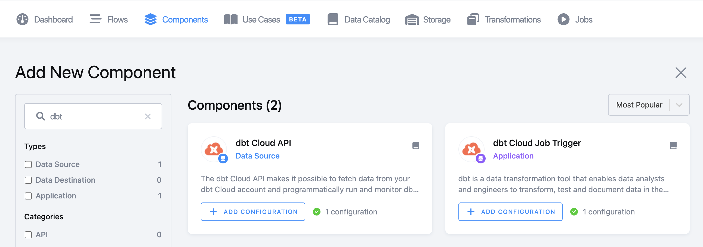
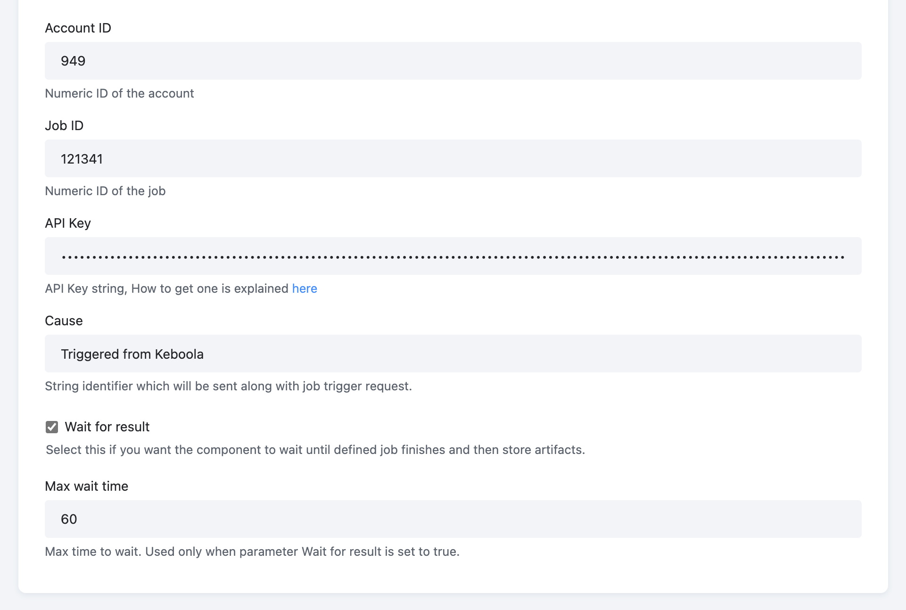
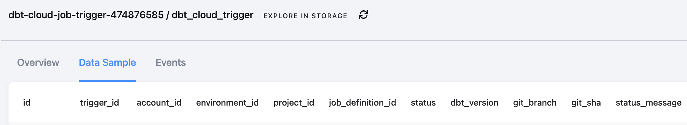
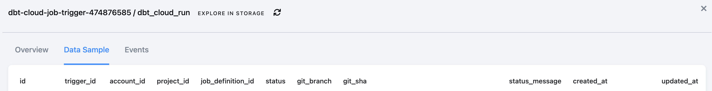
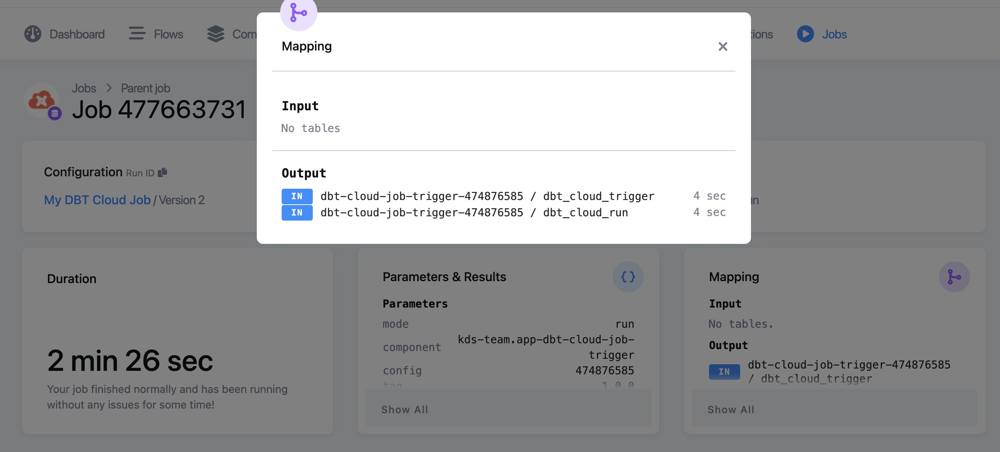
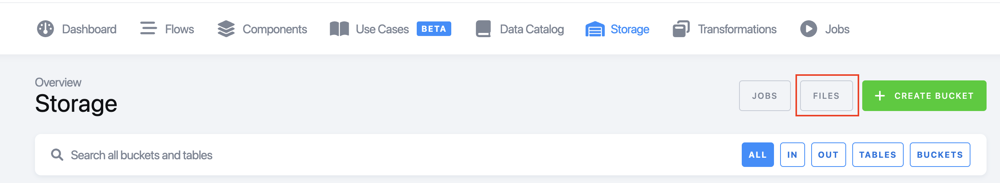
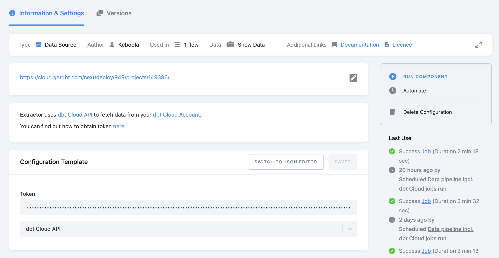

dbt Cloud is supported via dedicated components. You can find them in the menu section **Components**:

{: width="100%" }

*   `kds-team.ex-dbt-cloud-api` for extracting data from dbt Cloud API

*   `kds-team.app-dbt-cloud-job-trigger` for triggering a dbt Cloud job remotely, and optionally, wait for the job results. In that case, the component stores artifacts as well.

## dbt Cloud Trigger

{: width="100%" }

The component configuration is pretty straightforward. You must authorize the component by providing your `Account ID`, `Job ID`, and `API key`.

The component generates a status table called `dbt_cloud_trigger` storing the job trigger API response:

{: width="100%" }

When **Wait for result** is selected, the component polls the status until the job ends. The component has a default wait time limit that can be optionally set to a different time. When the option **Wait for result** is used, the component extracts artifacts, stores them in the file storage, and additionally, produces a job result API call table:

{: width="100%" }

Both tables can be found in the storage, or accessed directly from the job result:

{: width="100%" }

Artifacts can be found in the storage - files - search by tag:

{: width="100%" }

Search by tag (component type or configuration ID):

`tags:"componentId-kds-team.app-dbt-cloud-job-trigger"`

{: width="100%" }

**Tip:**: Those files can be also easily [retrieved externally via the API](https://keboola.docs.apiary.io/#reference/files/list-files/list-files) or from an integrated Jupyter workspace for further analysis.

*Note: Please keep in mind that the base URL of the API call depends on the stack you are using: US vs. Azure EU vs. EU central.*

## dbt Cloud API Source Component

The purpose of this source component is to extract and store the [dbt Cloud API](https://docs.getdbt.com/dbt-cloud/api-v2) information (data is stored incrementally) for the following endpoints:

*   accounts

*   projects

*   jobs

*   runs

*   run\_artifacts

To configure the source component, enter the API token and select a default configuration:

{: width="100%" }

You can access the data from the storage, or directly from the job detail screen:

{: width="100%" }

*Note: The source component utilizes our powerful Generic Extractor. In case you want to customize the extraction, select just some endpoints, etc. You can switch to the JSON schema and edit the configuration manually.*
