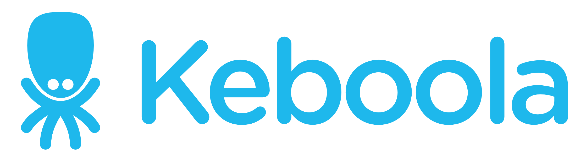
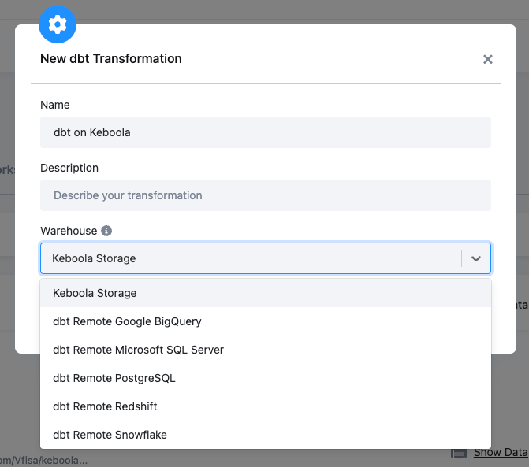
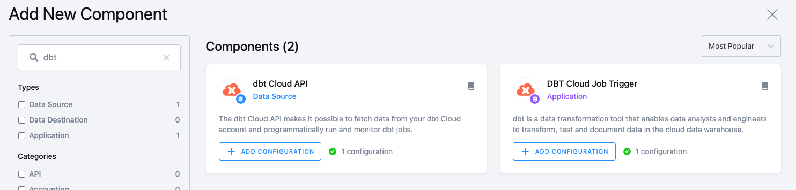
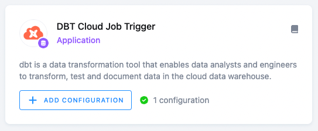

* TOC
{:toc}

[dbt™](https://www.getdbt.com/) is a transformation workflow that lets teams deploy analytics code quickly and collaboratively. It follows software engineering best practices like modularity, portability, CI/CD, and documentation. 
Now, anyone who knows SQL can build production-grade data pipelines.

Keboola brings dbt components to define, control, execute and schedule dbt in the context of the full data pipeline. This means that you can use dbt the same way you use other components. They are versioned, can be manually run and/or scheduled, controlled via CLI, and all actions are captured in the metadata layer.

## Prerequisites

You can either start with your existing dbt code project in a repository (private or public), or start with Keboola CLI to establish a development environment for creating a dbt project from scratch.

*   All **new PAYG projects** will have those features activated by default.

*   All **existing projects** can request the activation through a support request.

## Use Cases and Components

You can schedule and run dbt code in three environment types:

*   Run dbt within Keboola on Keboola storage.

*   Run dbt on an external DWH. In other words, execute remote jobs within their own DWH.

*   Orchestrate dbt Cloud jobs and extract details from the dbt Cloud API.

All components can be used in the flows, thus orchestrated with data pipeline definitions.

<table data-layout="wide">
<tbody>
<tr>
    <th>
        
            
        
        

            <strong>Keboola infrastructure</strong>
        

    </th>
    <th>
        
            
        
        

            <strong>Customer external DWH</strong>
        

    </th>
    <th>
        
            
        
        

            <strong>dbt Cloud</strong>
        

    </th>
</tr>
<tr>
    <td>
        

            <em>Keboola provisions all infrastructure automatically, including the development environment</em>
        

    </td>
    <td>
        

            <em>Customers use their own external infrastructure and development environments</em>
        

    </td>
    <td class="confluenceTd">
        

            <em>Development is provided by dbt Cloud and the execution is defined by users on their own infrastructure</em>
        

    </td>
</tr>
<tr>
    <td style="vertical-align: top !important;">
        
Go to:

        <ul>
            <li>Transformations</li>
            <li>Create new transformation</li>
            <li>dbt transformation</li>
            <li>Keboola Storage (default)</li>
        </ul>  
    </td>
    <td style="vertical-align: top !important;">
        
Go to:

        <ul>
            <li>Transformations</li>
            <li>Create new transformation</li>
            <li>dbt transformation</li>
            <li>select your DWH type</li>
        </ul> 
    </td>
    <td style="vertical-align: top !important;">
        
Go to:

        <ul>
            <li>Components</li>
            <li>search for "dbt"</li> 
        </ul>  
    </td> 
</tr>
<tr>
    <td style="vertical-align: top !important;">
        
    </td>
    <td style="vertical-align: top !important;">
        
            
        
    </td>
    <td style="vertical-align: top !important;">
        
            
        
    </td>
</tr>
<tr>
    <td style="vertical-align: top !important;">
        
When defining a dbt transformation configuration, use the output mapping to define tables from the execution to be imported within Keboola storage.

        
The execution engine stores artifacts and job run details in Keboola Metastore.

        
Additionally, the transformation UI provides deeper insights (thanks to artifacts) into the execution run, such as Timeline visualization and dbt docs.

    </td>
    <td style="vertical-align: top !important;">
        
Data is transformed in users’ DWH so no data is being transferred to the Keboola platform. However, the execution engine stores artifacts and job run details in Keboola Metastore.

        
Additionally, the transformation UI provides deeper insights (thanks to artifacts) into the execution run, such as Timeline visualization and dbt docs.

    </td>
    <td style="vertical-align: top !important;">
        
To <strong>trigger dbt Cloud jobs</strong>, use Trigger App:

        
        
You can opt to wait for results and store job artifacts and job run details in Keboola Metastore.

        
To <strong>extract metadata from dbt Cloud</strong>, use the dbt Cloud API data source:

        
    </td>
</tr>
</tbody>
</table>

*Note: Each component can have multiple configurations. They can differ by any configuration parameters. It is expected that users will have different configurations for different repositories. However, it is also possible for users to have different configurations for different branches (dev, prod, etc.), different run parameters (such as `tag: nighly`, model specification, etc.), or models to orchestrate portion of the dbt mono-repo.*

When using a dbt transformation on the Keboola infrastructure, you can additionally set up CLI with the local development environment against the provisioned infrastructure (workspace). Please see the dbt CLI section for more information.
